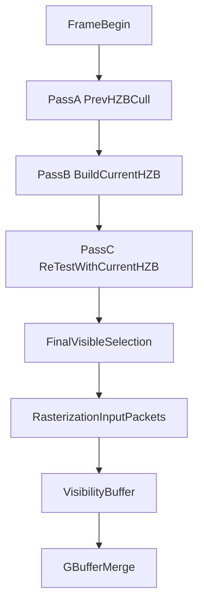

# Nanite Runtime HZB-Culling 落地计划

## 目标与默认策略
- 目标：把当前“仅 frustum + error”的 Runtime 升级为**上一帧 HZB 粗剔 + 当帧重建 HZB 再剔**，并保留你强调的 `parentError > threshold && selfError <= threshold` LOD 选择规则。
- 默认策略：先用 RendererFeature + RenderGraph 快速落地（可回滚、低侵入），验证稳定后再迁移到 URP 包内主循环位置对齐 UE 时序。

## 现有基础（可复用）
- 运行时选择与统计：[`Assets/Scripts/Nanite/NaniteRuntimeCulling.cs`](Assets/Scripts/Nanite/NaniteRuntimeCulling.cs)
- GPU 第一版剔除后端：[`Assets/Scripts/Nanite/NaniteGpuCullingBackend.cs`](Assets/Scripts/Nanite/NaniteGpuCullingBackend.cs)
- 选择结果数据结构：[`Assets/Scripts/Nanite/NaniteRuntimeSelection.cs`](Assets/Scripts/Nanite/NaniteRuntimeSelection.cs)
- 离线 BVH/Part/Page 数据：[`Assets/Scripts/Nanite/Editor/NaniteAssetBaker.cs`](Assets/Scripts/Nanite/Editor/NaniteAssetBaker.cs)、[`Assets/Scripts/Nanite/NaniteMeshPage.cs`](Assets/Scripts/Nanite/NaniteMeshPage.cs)

## 分阶段实施

### Phase 1: RendererFeature 下接入 HZB 双阶段剔除（M1）
- 新增 `NaniteRendererFeature` 与 3 组 pass：
  - PassA：读取**上一帧 HZB**做 instance/cluster 粗剔（输出候选簇）
  - PassB：用当前帧深度构建 HZB（intermediate/final）
  - PassC：对 PassA 剔除掉的候选进行 second-chance 复测（保守可见集合）
- 事件位置先放在：`BeforeRenderingPrePasses` / `AfterRenderingPrePasses` / `BeforeRenderingOpaques`，保证能拿到正确 depth 输入。
- 产出：`NaniteRuntimeSelection` 的最终可见簇集合（可直接供光栅化阶段消费）。

### Phase 2: GPU culling 正确性验证体系
- 保留并扩展验证菜单：
  - CPU(BVH) vs GPU(flat/BVH) 集合对拍
  - Two-pass(HZB) 前后集合对比（验证 second-chance 是否只“加回”不误删）
- 统计项标准化：`testedInstances/testedNodes/testedParts/testedClusters/visibleClusters`。
- 添加阈值回归场景：近景遮挡、远景大模型、跨 mip 边界接缝场景。

### Phase 3: 输出“光栅化前统一输入”
- 在 `NaniteRuntimeSelection` 基础上固定 GPU 侧消费格式：
  - page ranges
  - cluster packets（indexOffset/indexCount/subMesh/mip）
  - instance transform 引用
- 保证后续硬/软光栅均可使用相同可见簇输入。

### Phase 4: 迁移到 URP 包内同位时序（M2/M3 之前）
- 将 RendererFeature 验证过的 pass 迁移到 URP 主流程同位位置，目标贴近 UE 的双 pass 语义。
- 对齐入口：[`Packages/com.unity.render-pipelines.universal@37e0d4fc2503/Runtime/UniversalRendererRenderGraph.cs`](Packages/com.unity.render-pipelines.universal@37e0d4fc2503/Runtime/UniversalRendererRenderGraph.cs)
- 保留 Feature 开关，允许 A/B 对照（包内集成 vs feature 补丁）。

## 关键算法约束（会保持不变）
- LOD cut：`Projected(parentError) > lodErrorPixels && Projected(selfError) <= lodErrorPixels`
- Group 边界一致性依赖：离线 DAG 的单调误差 + 同组切换
- 两次 culling：Pass1 依赖上一帧 HZB，Pass2 依赖当前帧新 HZB 做保守回收

## 数据流（Runtime）

## 验收标准
- 正确性：GPU vs CPU 可见簇集合对拍 `missing=0 && extra=0`。
- 稳定性：`lodErrorPixels` 大范围变化（0~1000+）时不出现闪烁/错误剔除。
- 性能：在同场景下，GPU 两阶段剔除的 tested clusters 明显低于 brute force。
- 可演进性：`NaniteRuntimeSelection` 可直接连接下一步硬/软光栅与 VBuffer。