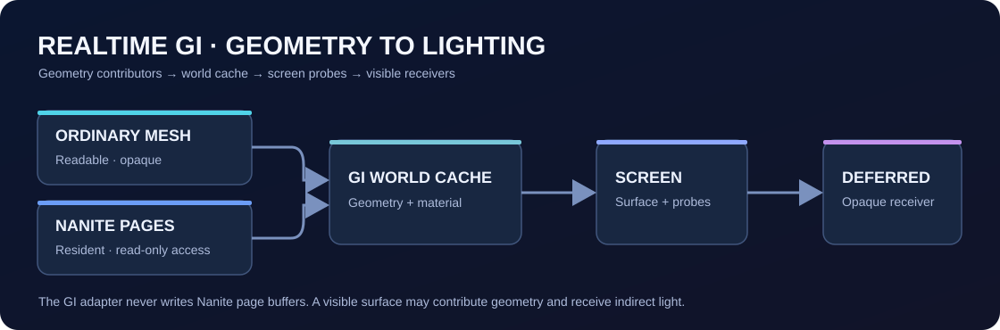

# 实时 GI 使用指南 / Realtime GI Guide

[返回首页 / Back to README](../README.md) · [中文](#中文) · [English](#english)

## 中文

### 1. 启动 GI

1. 确认项目使用 `Assets/Settings/PC_RPAsset.asset`，其 Renderer 是 `Assets/Settings/PC_Renderer.asset`，渲染模式为 **Deferred+**。项目默认 Graphics 设置已经指向 PC 资产；若换了画质档位或新建了 URP 资产，也要检查 Quality 设置中的覆盖项。
2. 选中 `PC_Renderer.asset`，在 **Renderer Features** 中确认 **GIWorldRendererFeature** 已添加且勾选启用。它在当前仓库中默认启用，`Diffuse Intensity` 默认大于 0；不要只在普通 Forward Renderer 上添加它，因为漫反射合成需要 Deferred GBuffer。
3. 将不透明物体和一个可用的 Camera 放在场景中，进入 **Play Mode**，看 **Game** 视图。Play Mode 只由 Game Camera 驱动一个 GI 世界缓存；编辑模式可通过 `Enable In Scene View` 在 Scene 视图预览。
4. 若自建 Renderer，添加 `GIWorldRendererFeature` 后检查 World Build、World Debug、Screen Surface、Screen Probe Compute Shader 与 Diffuse Composite Shader 是否有引用。组件的 `Create()` 会尝试从项目资源自动填充缺失引用。

最小验证场景可放一块不透明地面、一面不透明墙、一个带明显 Base Color 或 Emission 的不透明物体，以及朝向它们的 Camera。导入的地面、墙和物体若要参与世界缓存，都要在模型 Import Settings 开启 **Read/Write Enabled**。它们既可写入几何，也可在画面中接收间接光；不需要额外添加 GI Receiver 组件。

### 2. 哪些物体写入，哪些只读取

| 对象 | 进入 GI 的条件与行为 |
| --- | --- |
| 普通静态 Mesh | 启用的 `MeshRenderer + MeshFilter`、不透明材质，且 Mesh 的 Import Settings 中 **Read/Write Enabled**。GI 读取网格与材质颜色/自发光，并把几何写入自己的世界缓存。 |
| 仅 Transform 运动的普通 Mesh | 满足上一行，并在对象或父对象上有 `Rigidbody` 或 **Add Component → Unity Nanite → GI → Transform Tracked**。GI 跟踪位姿并更新受影响的缓存区域。 |
| Nanite 实例 | 启用的 `NaniteRuntimeProxy` 且已烘焙、Page 已常驻。GI 通过 **只读适配器**读取 Nanite 当前发布的 Page 缓冲，再把可用的几何信息写入 GI 世界缓存；它不会修改 Nanite Page。运动对象同样需要 `Rigidbody` 或 `GITransformTracked`。 |
| 接收间接光的表面 | 当前 Camera 的 Deferred GBuffer 中可见的不透明表面会参与屏幕探针与漫反射合成。没有单独的“GI Receiver”组件；同一个物体可以既提供几何又接收光照。 |

普通 Mesh 的透明 SubMesh、不可读网格、没有 `MeshFilter` 的对象不会进入世界缓存；`SkinnedMeshRenderer` 与顶点形变不属于当前几何采集路径。将场景物体配置好再进入 Play Mode：普通 Mesh 的场景拓扑在首次建立缓存时采集，Transform 运动按上表持续跟踪。Nanite 的“只读”是指**对 Nanite 缓冲只读**，不是指它不能对 GI 作出贡献。

### 3. 调试与成功判据

1. 在 `PC_Renderer.asset → GIWorldRendererFeature` 勾选 **Enable Debug**。先选 **Surface** 看世界缓存表面覆盖，再选 **Source** 看几何来源；移动带 `GITransformTracked` 的物体时可用 **Dirty Rebuilt** 检查重建区域。**Screen Surface Radiance** 和 **Primary Probe Placement** 可检查屏幕阶段。调试结果覆盖 Game 画面，用完关闭 Enable Debug。
2. Console 应出现 `[GI][Node1] Renderer feature ready`、`[GI][Node2] Ordinary Mesh scene: instances=...`、`[GI][Node2] World mapping: active=...` 和 `[GI][Node3] Diffuse gather active` 等信息。至少一个有效普通 Mesh 时，`instances` 应大于 0；若有 `unreadableSkipped`，检查是否包含你期望写入的模型。有 Nanite 实例时，`Nanite topology: instances=...` 应大于 0，`Nanite read-only view` 中的 `resident` 也应大于 0。这些日志只说明对应阶段运行，还需结合调试画面检查覆盖。
3. 关闭 Debug 后，在同一静止画面比较 **Diffuse Intensity = 0** 与 **1**。有可见间接光差异，且 Console 没有 `Renderer feature unavailable`、Compute Shader 或 RenderGraph 错误，才算完成基本视觉验证。没有光照差异时先检查 Deferred+、Renderer Feature、材质不透明性、Read/Write 和 Camera 所在的场景。
4. 需要保存调试画面时，在 Play Mode 运行 **GI → Diagnostics → Capture Node 1 Debug**；截图写入本地 `tmp/gi-node1-validation-20260818/`，该目录不会提交到 Git。

## English

### 1. Enable GI

1. Use `Assets/Settings/PC_RPAsset.asset` with `Assets/Settings/PC_Renderer.asset` in **Deferred+** mode. The repository's default Graphics setting uses the PC asset; check any Quality-level override if you switch quality tiers or create another URP asset.
2. Select `PC_Renderer.asset` and confirm that **GIWorldRendererFeature** exists and is enabled under **Renderer Features**. It is enabled in this repository, with a nonzero `Diffuse Intensity`. The diffuse composite needs a Deferred GBuffer, so a plain Forward Renderer is insufficient.
3. Put opaque geometry and a Camera in the scene, enter **Play Mode**, and inspect the **Game** view. In Play Mode, one Game Camera owns the GI world cache. In Edit Mode, `Enable In Scene View` allows Scene view preview.
4. If you make a new Renderer, add `GIWorldRendererFeature` and check its World Build, World Debug, Screen Surface, Screen Probe, and Diffuse Composite shader references. The feature attempts to fill missing references from project resources in `Create()`.

For a small verification scene, add an opaque floor, an opaque wall, an opaque object with a distinct Base Color or Emission, and a Camera aimed at them. Enable **Read/Write Enabled** in the Import Settings of any imported mesh that should enter the world cache. These surfaces can contribute geometry and receive indirect light; no GI Receiver component is needed.

### 2. Geometry sources and receivers

| Object | GI behavior |
| --- | --- |
| Ordinary static mesh | Needs an enabled `MeshRenderer + MeshFilter`, an opaque material, and **Read/Write Enabled** in the mesh Import Settings. GI reads geometry, base color, and emission and writes them into its own world cache. |
| Ordinary mesh with rigid Transform motion | Meets the previous conditions and has a `Rigidbody` or **Add Component → Unity Nanite → GI → Transform Tracked** on itself or a parent. GI tracks its transform and refreshes affected cache regions. |
| Nanite instance | Needs an enabled `NaniteRuntimeProxy`, a baked mesh, and resident pages. GI uses a **read-only adapter** for Nanite's published page buffers, then contributes available geometry to the GI world cache. It never modifies Nanite pages. Rigid motion also needs `Rigidbody` or `GITransformTracked`. |
| Indirect-light receiver | Visible opaque surfaces in the camera's Deferred GBuffer participate in screen-probe gathering and diffuse compositing. There is no separate GI Receiver component; a surface may both contribute geometry and receive lighting. |

Transparent ordinary-mesh submeshes, unreadable meshes, and objects without a `MeshFilter` are skipped by the world cache. `SkinnedMeshRenderer` and vertex deformation are outside the current geometry collection path. Configure ordinary meshes before entering Play Mode: their topology is collected when the cache is first built, while marked Transform motion is tracked afterward. “Read-only” describes GI's access to **Nanite buffers**, not whether Nanite geometry contributes to GI.

### 3. Debugging and verification

1. Enable **Enable Debug** on `PC_Renderer.asset → GIWorldRendererFeature`. Use **Surface** to inspect world-cache coverage and **Source** to inspect source geometry. **Dirty Rebuilt** helps inspect updates when a `GITransformTracked` object moves. **Screen Surface Radiance** and **Primary Probe Placement** show screen-space stages. Debug replaces the Game image; turn it off afterward.
2. Look for `[GI][Node1] Renderer feature ready`, `[GI][Node2] Ordinary Mesh scene: instances=...`, `[GI][Node2] World mapping: active=...`, and `[GI][Node3] Diffuse gather active` in the Console. With a valid ordinary mesh, `instances` should be greater than zero; if `unreadableSkipped` is nonzero, check whether it includes a model you expected to contribute. With a Nanite instance, `Nanite topology: instances=...` should be greater than zero and `resident` in `Nanite read-only view` should also be greater than zero. Logs confirm that stages ran; inspect the debug image for actual coverage.
3. Turn Debug off and compare **Diffuse Intensity = 0** versus **1** in the same still view. A visible indirect-light difference, without `Renderer feature unavailable`, compute-shader, or RenderGraph errors, is the basic visual success check. If the image does not change, check Deferred+, the feature, opacity, Read/Write, and the scene camera.
4. In Play Mode, **GI → Diagnostics → Capture Node 1 Debug** saves a screenshot under the local, Git-ignored `tmp/gi-node1-validation-20260818/`.
