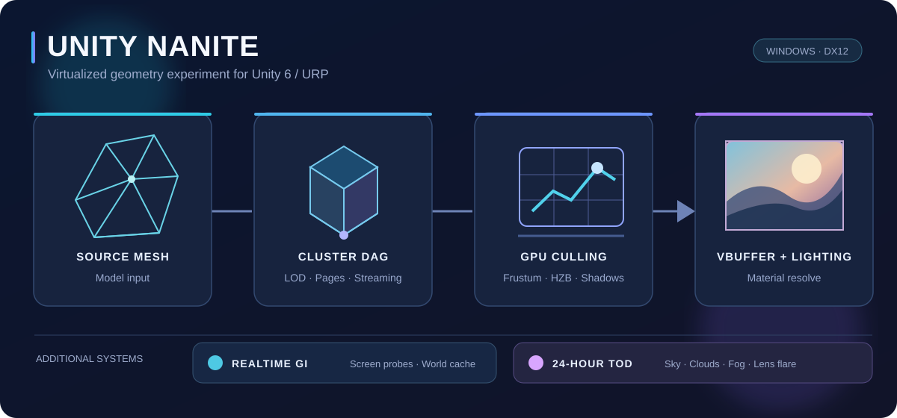

# UnityNanite

[中文](#中文) · [English](#english)

> Unity 6 / URP rendering playground for Nanite-style virtualized geometry, realtime GI, and a 24-hour sky.

> 基于 Unity 6 / URP 的 Nanite 风格虚拟几何、实时 GI 与 24 小时天空渲染实验。

*项目验证帧中的 TOD 天空 / TOD sky from a project validation capture.*

## 中文

### 项目简介

UnityNanite 是一个面向 **Unity 6000.3.10f1 + URP 17.3.0** 的图形实验项目。核心是把高面数模型离线拆分为 Cluster、Part 和可流送的 Page，在运行时通过 GPU 层级剔除与连续 LOD 选择可见几何，再用 VBuffer 完成材质解析。项目也包含独立的昼夜系统和仍在迭代的实时 GI。

当前主要面向 **Windows x64 / Direct3D 12**。它借鉴了虚拟几何的设计思路，不等同于 Unreal Engine 的 Nanite 实现。

### 功能

- **离线几何烘焙：** 借助 meshoptimizer 原生插件构建 Cluster 层级、连续 LOD、Part 和压缩 Page。
- **GPU 驱动渲染：** 视锥与 HZB 遮挡剔除、两阶段可见性选择、Page 常驻管理、VBuffer 材质解析和阴影路径。默认生产栅格模式为 HardwareOnly；Hybrid 路径保留用于实验。
- **实时 GI：** 屏幕探针、世界空间缓存与 Nanite 几何适配，目前仍是实验模块。
- **24 小时 TOD：** 可编辑的昼夜 Profile，以及动态天空、云、云影、雾和太阳/月亮 Lens Flare；该模块可以独立使用。
- **验证工具：** Unity 编辑器诊断菜单、DX12 构建检查、RenderDoc 捕获与 GPU 时间分析脚本。

### 目录结构

| 路径 | 内容 |
| --- | --- |
| [Assets/Scripts/Nanite](Assets/Scripts/Nanite) | 几何烘焙、运行时剔除、Page 管理、VBuffer 和编辑器工具 |
| [Assets/GI](Assets/GI) | 实时 GI 的运行时 Pass、Compute Shader 与验证入口 |
| [Assets/TOD](Assets/TOD) | 独立的昼夜系统；见 [TOD 使用说明](Assets/TOD/README.md) |
| [Assets/Scenes](Assets/Scenes) | 示例场景 `SampleScene` |
| [Assets/Sponza](Assets/Sponza) / [Assets/Shaderball2](Assets/Shaderball2) | 场景与模型资源 |
| [Packages](Packages) | 包清单及包含 Nanite 桥接修改的内嵌 URP |
| [Native/API_CPP](Native/API_CPP) | meshoptimizer 的 C++ 插件封装与构建说明 |
| [Tools](Tools) | Nanite 验收、RenderDoc 捕获与分析脚本 |
| [ProjectSettings](ProjectSettings) | Unity 工程设置 |

### 快速开始

1. 用 **Unity 6000.3.10f1** 打开仓库根目录。等待 Package Manager 完成导入；项目使用仓库内的定制 URP 包。
2. 在 Windows 上使用 **Direct3D 12**，打开 `Assets/Scenes/SampleScene.unity`。
3. 在 Unity 菜单中选择 **Nanite → Bake Nanite...** 烘焙模型；`Assets/Plugins/x86_64/API_CPP.dll` 是随项目提供的 Windows 原生插件。需要重编译时参见 [原生插件说明](Native/API_CPP/README.md)。
4. 若要体验昼夜系统，参见 [TOD 快速开始](Assets/TOD/README.md)。在构建 Windows Player 前，可运行 **Tools → Nanite → Validate DX12 Portability Contract**。

这是图形研究工程，不保证其他平台、渲染 API 或 Unity 版本可直接运行。

### 参考与致谢

- [Unreal Engine Nanite 文档](https://dev.epicgames.com/documentation/en-us/unreal-engine/nanite-virtualized-geometry-in-unreal-engine)：虚拟几何的概念与设计参考。
- [meshoptimizer](https://github.com/zeux/meshoptimizer)：网格处理算法与原生插件依赖；见其 MIT 许可证。
- [Unity URP 文档](https://docs.unity3d.com/6000.3/Documentation/Manual/urp/urp-introduction.html)：URP、Renderer Feature 与 Render Graph 的接口参考。
- [RenderDoc](https://renderdoc.org/)：图形帧捕获与 GPU 性能分析工具。

仓库目前没有统一的项目许可证；第三方代码与资源仍受各自许可证约束。

## English

### Overview

UnityNanite is a graphics experiment built with **Unity 6000.3.10f1 and URP 17.3.0**. It bakes high-poly meshes into clusters, parts, and streamable pages. At runtime, GPU hierarchy culling and continuous LOD select visible geometry, and a VBuffer resolves materials. The repository also includes an independent time-of-day system and an evolving realtime GI module.

The current target is **Windows x64 with Direct3D 12**. The project takes inspiration from virtualized geometry techniques; it is not an Unreal Engine Nanite port.

### Features

- **Offline geometry baking:** Builds a cluster hierarchy, continuous LOD, parts, and compressed pages using a native meshoptimizer wrapper.
- **GPU-driven rendering:** Frustum and HZB occlusion culling, two-stage visibility selection, page residency, VBuffer material resolve, and shadows. HardwareOnly is the production raster mode; Hybrid is experimental.
- **Realtime GI:** Screen probes, a world-space cache, and Nanite geometry integration. This module is still experimental.
- **24-hour time of day:** Editable profiles, sky, clouds, cloud shadows, fog, and sun/moon lens flares. It can be used independently.
- **Diagnostics:** Unity editor validation menus, a DX12 build guard, and RenderDoc capture and GPU timing scripts.

### Repository layout

| Path | Purpose |
| --- | --- |
| [Assets/Scripts/Nanite](Assets/Scripts/Nanite) | Baking, runtime culling, page management, VBuffer, and editor tools |
| [Assets/GI](Assets/GI) | GI runtime passes, compute shaders, and validation entry points |
| [Assets/TOD](Assets/TOD) | Independent time-of-day module; see its [guide](Assets/TOD/README.md) |
| [Assets/Scenes](Assets/Scenes) | `SampleScene` demo scene |
| [Assets/Sponza](Assets/Sponza) / [Assets/Shaderball2](Assets/Shaderball2) | Scene and model assets |
| [Packages](Packages) | Package manifest and the embedded URP package with a Nanite bridge |
| [Native/API_CPP](Native/API_CPP) | C++ meshoptimizer wrapper and build instructions |
| [Tools](Tools) | Nanite acceptance and RenderDoc analysis scripts |
| [ProjectSettings](ProjectSettings) | Unity project configuration |

### Getting started

1. Open the repository root in **Unity 6000.3.10f1** and allow Package Manager to import the embedded URP package.
2. On Windows, select **Direct3D 12** and open `Assets/Scenes/SampleScene.unity`.
3. Use **Nanite → Bake Nanite...** to bake a mesh. The repository includes `Assets/Plugins/x86_64/API_CPP.dll`; see the [native plugin guide](Native/API_CPP/README.md) if you need to rebuild it.
4. Follow the [TOD guide](Assets/TOD/README.md) to try the sky system. Before building a Windows Player, run **Tools → Nanite → Validate DX12 Portability Contract**.

This is a graphics research project. Other platforms, graphics APIs, and Unity versions are not verified.

### References and credits

- [Unreal Engine Nanite documentation](https://dev.epicgames.com/documentation/en-us/unreal-engine/nanite-virtualized-geometry-in-unreal-engine) — conceptual reference for virtualized geometry.
- [meshoptimizer](https://github.com/zeux/meshoptimizer) — mesh processing algorithms and native dependency, under its MIT license.
- [Unity URP documentation](https://docs.unity3d.com/6000.3/Documentation/Manual/urp/urp-introduction.html) — URP, Renderer Feature, and Render Graph APIs.
- [RenderDoc](https://renderdoc.org/) — graphics capture and GPU analysis.

No repository-wide license is currently provided. Third-party code and assets retain their own license terms.
